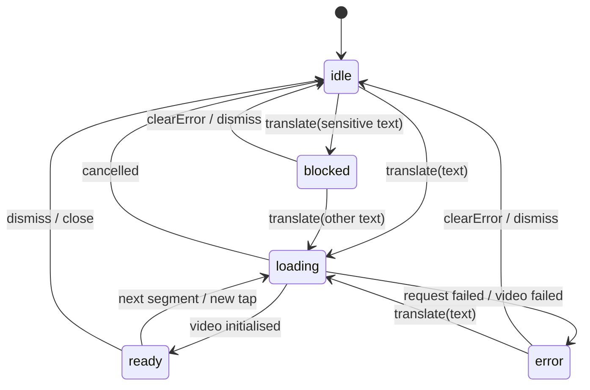

# 02 — Architecture

## Layers

The SDK has four layers. Only the top one is platform-shaped; the other three
are the port.

| Layer | Responsibility | Reference implementation |
| --- | --- | --- |
| **Integration** | Mounts the SDK above the host app, supplies config, exposes the controller, forwards events | `signfordeaf_init.dart`, `signfordeaf_sign.dart`, `signfordeaf_area.dart`, `signfordeaf_body.dart`, `signfordeaf_host.dart` |
| **Configuration** | Holds the resolved settings and the sensitive-text registry for the process | `signfordeaf_manager.dart`, `config/signfordeaf_config.dart` |
| **Controller** | All state and every action; the single source of truth | `signfordeaf_controller.dart` |
| **Service** | The backend calls and their retry/cancel behavior | `service/service.dart`, `model/sign_model.dart` |
| **Views** | Player, floating button, tap detection, caption | `views/`, `signfordeaf_floating_button.dart`, `tap_to_translate.dart` |

Data flows one way: views call controller actions, the controller mutates state
and notifies, views re-render from that state. Views MUST NOT hold translation
state of their own — v1 bugs like the floating button forgetting its position
came from exactly that (see [07](07-floating-button.md)).

### What the integration layer must provide

Whatever shape it takes on your platform, it MUST be able to:

1. **Render above the host app** — three independent layers, bottom to top:
   the app wrapped in the tap detector, the floating button, and the player.
   Each layer rebuilds on controller changes without rebuilding the app subtree.
2. **Apply configuration before the first frame**, so the first render already
   has the right theme, language and ids.
3. **Own or accept a controller** — created internally by default, or supplied
   by the host so it can drive the SDK from its own UI.
4. **Forward the event stream** to an optional host callback.

The host MAY mount the SDK around its whole app or around one region only. The
region form skips the credential requirement, since the app root supplies them.

### Configuration is process-global

The resolved configuration and the sensitive-text registry live in one
process-wide instance, not per player. Two SDK mount points in one app share
them. This is deliberate: `fdid`/`tid` can be overridden by the backend
mid-session ([10](10-placeholder-avatars.md)) and every later request must use
the corrected pair, wherever it originates.

Configuration MUST be applied in this precedence:

1. A single config object, if given — it sets *every* field at once.
2. Otherwise the individual parameters that were given (credentials, language,
   theme, floating button), each leaving unset fields at their default.

## Translation state machine

Five states. Exactly one is active at any time.

| State | Meaning | Player shows |
| --- | --- | --- |
| `idle` | Nothing in flight, nothing to play | Idle signer loop, unblurred |
| `loading` | A translation is in flight | Idle signer loop, blurred, spinner over it |
| `ready` | A video is playable | The translation video, controls live |
| `error` | The request or the video failed | Failure message inside the stage |
| `blocked` | The text was refused as sensitive | Refusal message inside the stage |

Two derived flags drive the UI and MUST be computed, not stored:

- **Player visible** = the player was opened by the user **OR** the state is not
  `idle`. The second clause is what makes a purely programmatic `translate(...)`
  visible in a host that never calls `openCard`.
- **Playback available** = state is `ready`.

## Translating a segment

This sequence is normative. The numbered steps happen in this order.

1. **Take a request token.** Increment a monotonic counter and keep the value.
   Every later step re-checks it and aborts silently if it no longer matches —
   this is what stops a slow older response from overwriting a newer
   translation. Rapid taps and fast segment navigation make this routine, not
   exceptional.
2. **Reset per-translation state**: translation id, feedback vote,
   acknowledgement, error.
3. **Restore playback preferences** if not already restored — *before* the
   request, so the control bar shows the user's stored speed and loop choice
   while the translation is still loading rather than flipping to them
   afterwards.
4. **Sensitive check.** If the segment is sensitive, go to `blocked`, emit the
   blocked event, and stop. Nothing is sent. ([11](11-sensitive-data.md))
5. **Emit `textSelected`.**
6. **Cache lookup.** On a hit: restore its translation id, go to `loading`,
   start the prefetch, and skip to step 9 with the cached URL. No request is
   made.
7. **Go to `loading`, emit `translationStart`, send the request.**
   ([03](03-api-contract.md))
8. **Handle the response** — token check first, then in order:
   - cancelled → back to `idle`, emit a `cancelled` translation error;
   - adopt any `tid`/`fdid` the backend served ([10](10-placeholder-avatars.md));
   - missing state or base URL → `error` (`apiError`);
   - otherwise assemble the video URL, remember it in the cache, and start the
     prefetch immediately — the network round trip is the slow part, so the next
     sentence is warmed while this video is still initialising.
9. **Initialise the video**: dispose the previous one, apply the stored loop and
   speed, play, go to `ready`, and emit `panelOpen`, `videoStart` and
   `translationComplete` in that order. A failure here is `error`
   (`videoError`).

### Cache

- Keyed by the exact segment text; value is the video URL and translation id.
- Bounded at **40 entries**, evicting the oldest insertion first. Re-inserting
  an existing key moves it to the newest position.
- A cache hit MUST NOT re-request. Stepping back and forth through the sentences
  of a paragraph, or tapping the same text twice, is free.
- The cache does not survive an app launch. ([14](14-persistence.md))

### Prefetch

Exactly **one** sentence ahead — the segment after the current one — started as
soon as the current translation resolves.

- MUST be silent: it touches neither the state, the request token nor the UI. A
  prefetch can never change what is on screen.
- MUST skip text that is already cached or already being prefetched.
- MUST skip sensitive text: blocked text never reaches the network, prefetch
  included.
- MUST NOT adopt backend-served ids ([10](10-placeholder-avatars.md)).
- A failure is ignored — the sentence is simply fetched on demand later.

Fetching every segment at once is explicitly rejected: it hammers the backend
for work that is usually wasted, since users routinely close the player after
the first sentence.

## Player lifecycle

The player *is* the mode. There is no invisible tap mode in v2.

| Action | Player | Tap mode | Playback | Floating button |
| --- | --- | --- | --- | --- |
| **Open** (button tap) | opens, expanded | on | — | hidden |
| **Collapse** | folds to its control bar | **off** | paused | hidden |
| **Expand** | restores | on | resumes if it was playing | hidden |
| **Close** (✕) | closes | off | released | visible again |
| **Disable SDK** | closes | off | released | hidden |

Rules:

- Opening the player MUST consume one hint-bubble show if any budget remains
  ([07](07-floating-button.md)).
- Collapsing is the user saying *get out of the way*: the app goes fully native
  and playback pauses, because a sign language video nobody can see only spends
  battery. Expanding restores both, resuming only if it was playing before.
- Closing while a translation is in flight MUST cancel it; closing otherwise
  releases the video. Either way segments, translation id and feedback state are
  cleared.
- The floating button is hidden whenever the player is visible — the player
  carries its own expand and close, so a second affordance for the same thing is
  clutter.

## Enable / disable

- The SDK starts **disabled**: no taps intercepted, no button, host app fully
  native. `autoEnable` opts out of that.
- Disabling MUST close the player, cancel anything in flight, turn tap mode off
  and hide the hint. It MUST NOT clear stored preferences or the button's
  resting place — re-enabling restores the user's setup.

## Threading and lifetime

- All state transitions happen on the UI thread; only the network call and the
  video decoder work off it.
- The video decoder MUST be released when the player closes, when a new
  translation starts, and when the SDK is disposed. Android caps concurrent
  hardware decoders, and the SDK has no business holding one between
  translations — this applies to the idle avatar loop too
  ([10](10-placeholder-avatars.md)).
- The event stream MUST be closed on disposal, and emitting to a closed stream
  MUST be a no-op rather than an error.

## Source of truth

- `lib/src/signfordeaf_controller.dart`
- `lib/src/signfordeaf_manager.dart`
- `lib/src/signfordeaf_host.dart`
- `lib/src/signfordeaf_init.dart`, `signfordeaf_sign.dart`, `signfordeaf_area.dart`
